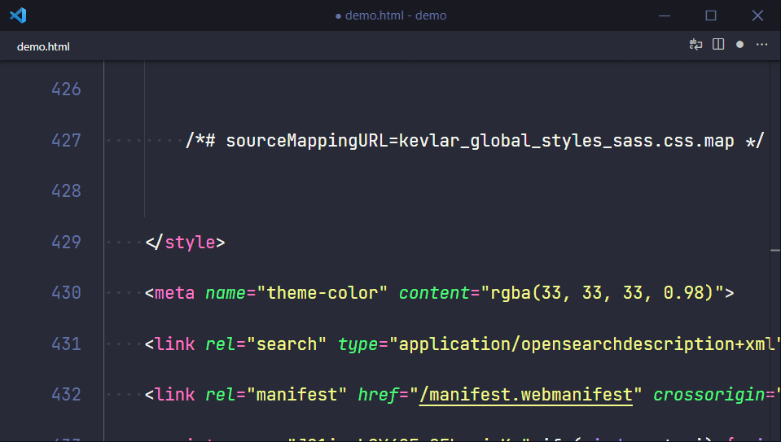

# Code Zoom

Make code small, make code big. Easy as that.

## Features

This extension gives to two commands to run from the command palette, or to bind to any keyboard shortcuts you like.

### Code Zoom: Default

> `code-zoom.default`

This command resets your settings to the default font size and line height.

### Code Zoom: Small

> `code-zoom.small`

This command makes your font size and line height super small, so you can get a good overview.

## Release Notes

### 0.1.0

Initial release.
